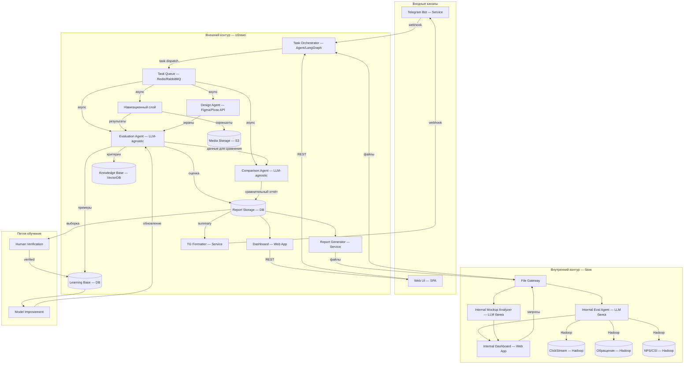
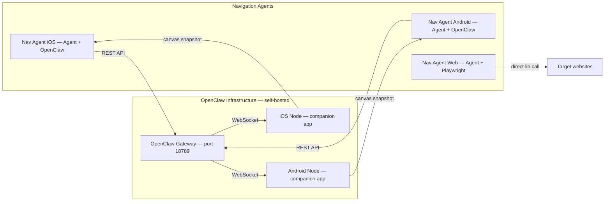
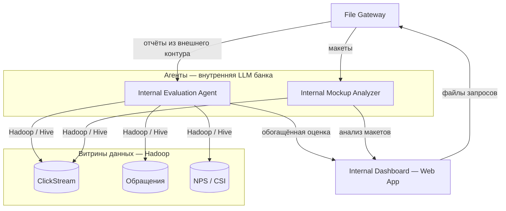

# Архитектура CJXplorer

## Обзор

Система состоит из двух контуров (внешний и внутренний), связанных файловым обменом. Основная вычислительная логика — во внешнем контуре (облако). Внутренний контур банка содержит зеркальную агентскую логику на внутренней LLM и доступ к данным аналитики.

---

## Схема 1: Общая архитектура



---

## Схема 2: Навигационный слой (детализация)



---

## Схема 3: Внутренний контур (детализация)



---

## Описание компонентов

### Входные каналы

| Компонент | Тип | Протокол |
|-----------|-----|----------|
| **Telegram Bot** | Service / Python | webhook / REST |
| **Web UI** | SPA | REST API |

### Оркестрация

| Компонент | Тип | Протокол |
|-----------|-----|----------|
| **Task Orchestrator** | Agent / LangGraph | LangGraph internal |
| **Task Queue** | Broker (Redis / RabbitMQ) | async messaging |

### Навигационный слой

| Компонент | Тип | Протокол |
|-----------|-----|----------|
| **Navigation Agent iOS** | Agent + OpenClaw | REST API → OpenClaw Gateway |
| **Navigation Agent Android** | Agent + OpenClaw | REST API → OpenClaw Gateway |
| **Navigation Agent Web** | Agent + Playwright | direct library call |
| **OpenClaw Gateway** | Self-hosted service (port 18789) | REST (inbound), WebSocket (to nodes) |
| **iOS Node** | OpenClaw companion app | WebSocket → Gateway |
| **Android Node** | OpenClaw companion app | WebSocket → Gateway |

### Слой оценки

| Компонент | Тип | Протокол |
|-----------|-----|----------|
| **Evaluation Agent** | Agent / LLM-agnostic | LangGraph internal |
| **Comparison Agent** | Agent / LLM-agnostic | LangGraph internal |

### Слой дизайна

| Компонент | Тип | Протокол |
|-----------|-----|----------|
| **Design Agent** | Agent + Figma API + Pixso API | REST API |

### Слой данных

| Компонент | Тип | Хранит |
|-----------|-----|--------|
| **Media Storage** | S3-compatible | Скриншоты, видео (долгосрочно) |
| **Report Storage** | DB + Object Store | История оценок, динамика |
| **Knowledge Base** | Vector DB + Files | Критериальная модель, эвристики |
| **Learning Base** | DB | Верифицированные good/bad сценарии |

### Формирование выхода

| Компонент | Тип | Протокол |
|-----------|-----|----------|
| **Report Generator** | Service | internal |
| **Dashboard** | Web App | REST API |
| **Telegram Formatter** | Service | webhook |

### Внутренний контур (банк)

| Компонент | Тип | Протокол |
|-----------|-----|----------|
| **File Gateway** | File exchange | file transfer |
| **Internal Evaluation Agent** | Agent / внутренняя LLM банка | Hadoop / Hive к витринам |
| **Internal Mockup Analyzer** | Agent / внутренняя LLM банка | Hadoop / Hive к витринам |
| **ClickStream** | Data source / Hadoop | Hive |
| **Обращения** | Data source / Hadoop | Hive |
| **NPS / CSI** | Data source / Hadoop | Hive |
| **Internal Dashboard** | Web App | internal |

### Петля обучения

| Компонент | Тип | Назначение |
|-----------|-----|-----------|
| **Human Verification** | UI / процесс | Эксперты верифицируют выборочные оценки |
| **Model Improvement** | Fine-tuning / Few-shot | Обновление промптов или дообучение модели |

---

## Потоки данных (основные сценарии)

### Сценарий 1: Оценка по скриншотам

```
Web UI / TG ──REST──→ Orchestrator ──task──→ Queue
  → Evaluation Agent (читает KB, оценивает по критериям)
  → Comparison Agent (если несколько CJ)
  → Report Storage → Dashboard / TG Formatter
```

### Сценарий 2: Автономное исследование

```
TG: "Исследуй путь открытия кредитки в Сбере, Тинькофф, Альфе"
  ──webhook──→ Orchestrator (декомпозиция: 3 параллельных задачи)
  ──tasks──→ Queue
  → Nav Agent iOS ──REST──→ OpenClaw GW ──WS──→ iOS Node (Сбер)
  → Nav Agent Android ──REST──→ OpenClaw GW ──WS──→ Android Node (Тинькофф)
  → Nav Agent Web ──Playwright──→ Web (Альфа)
  → Media Storage (скриншоты каждого шага)
  → Evaluation Agent × 3
  → Comparison Agent (сравнение)
  → Report Storage → TG / Dashboard
  → File Gateway → Internal Agent (обогащение ClickStream/NPS)
```

### Сценарий 3: Оценка макетов (Figma/Pixso)

```
Web UI / внутренний контур ──REST / файлы──→ Orchestrator
  → Design Agent ──Figma API──→ получает экраны
  → Evaluation Agent → Report Storage → Dashboard / файлы → внутренний контур
```

### Сценарий 4: Обогащение данными (внутренний контур)

```
File Gateway ──файлы──→ Internal Evaluation Agent
  ──Hadoop──→ ClickStream (% drop-off)
  ──Hadoop──→ Обращения (подтверждение проблем)
  ──Hadoop──→ NPS/CSI (корреляция)
  → Internal Dashboard
```

---

## Принципы

1. **LLM-агностик** — каждый агент работает с любой моделью
2. **Модульность** — компоненты заменяемы независимо
3. **Параллелизм** — несколько приложений/конкурентов одновременно
4. **Два контура** — внешний (вычисления) + внутренний (данные), связь через файлы
5. **Эволюционность** — от оценки к созданию CJ
6. **Простота стека** — LangGraph, REST, WebSocket, SQL
